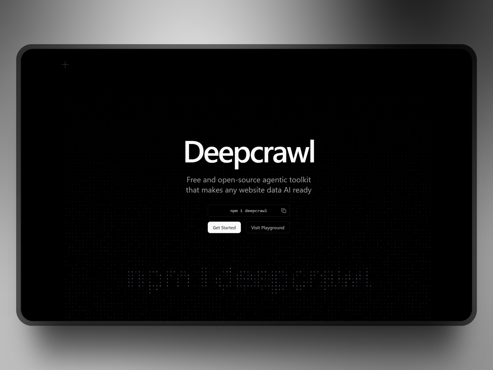

# Deepcrawl

> WARNING: DO NOT USE DEEPCRAWL IN PRODUCTION RIGHT NOW AS IT IS SUBJECT TO CHANGE AND STILL UNDER RAPID DEVELOPMENT. USE WITH YOUR OWN RISK!

**100% free and open-source Firecrawl alternative with better performance and flexibility.**

Deepcrawl is an agents-oriented website data context extraction platform. It extracts cleaned markdown of page content, agent-favoured hierarchical links tree and metadata that LLMs can digest with minimal token cost to reduce context switching and hallucination.

> Full Platform (Nextjs Dashboard, API Workers, Auth Workers, and Database) is open and transparent.

## Documentation

Visit https://deepcrawl.dev/docs to view the documentation.

## Contributing

Please read the [contributing guide](./CONTRIBUTING.md).

## License

Open Source. Open Code - built with ❤️ by [@felixLu](https://x.com/felixlu1018).
