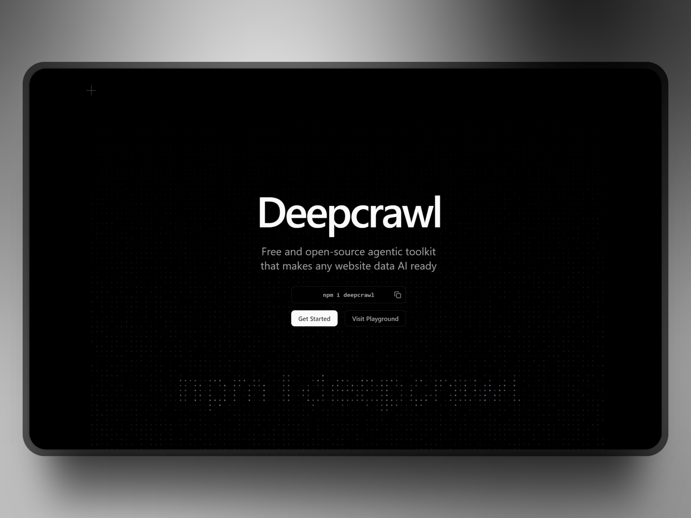

# Deepcrawl

> WARNING: DO NOT USE DEEPCRAWL IN PRODUCTION RIGHT NOW AS IT IS SUBJECT TO CHANGE AND STILL UNDER RAPID DEVELOPMENT. USE WITH YOUR OWN RISK!

**100% free and open-source Firecrawl alternative with better performance and flexibility.**

Deepcrawl is an open-source agents-oriented web page context extraction platform. It extracts cleaned markdown of page content, agent-favoured links tree and page metadata that LLMs can digest with minimal token cost to reduce context switching and hallucination.

## License

MIT License - Open Source. Open Code - built with ❤️ by [@felixLu](https://x.com/felixlu1018).
